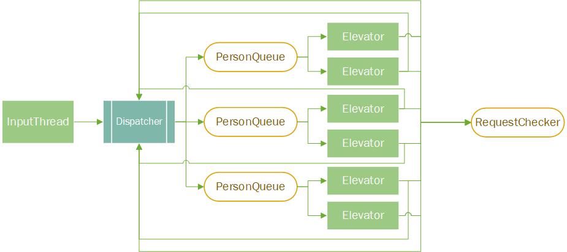
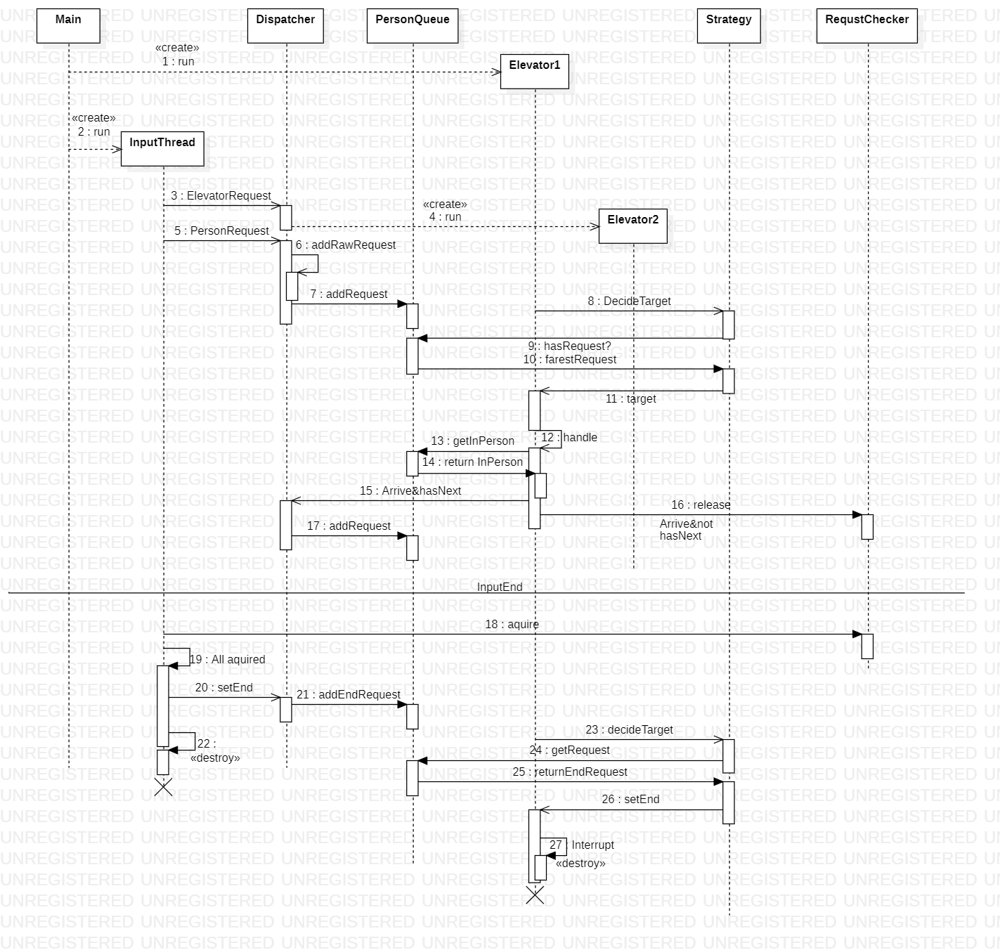
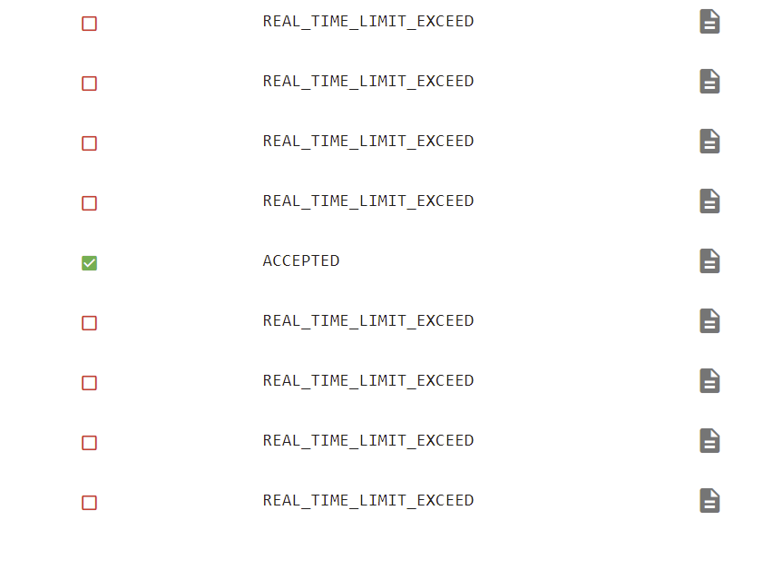
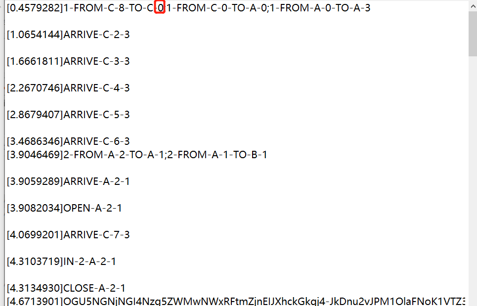
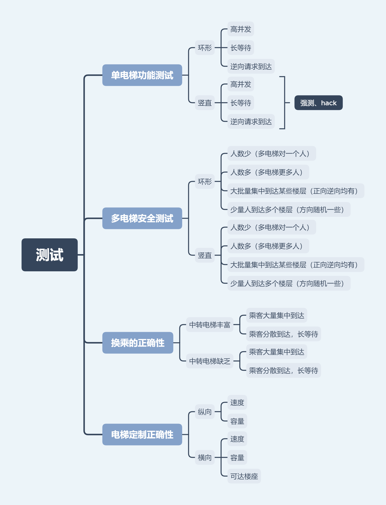
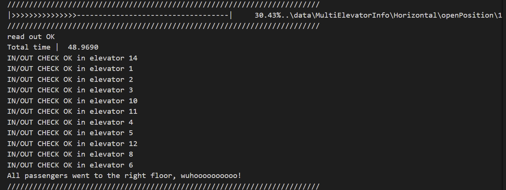
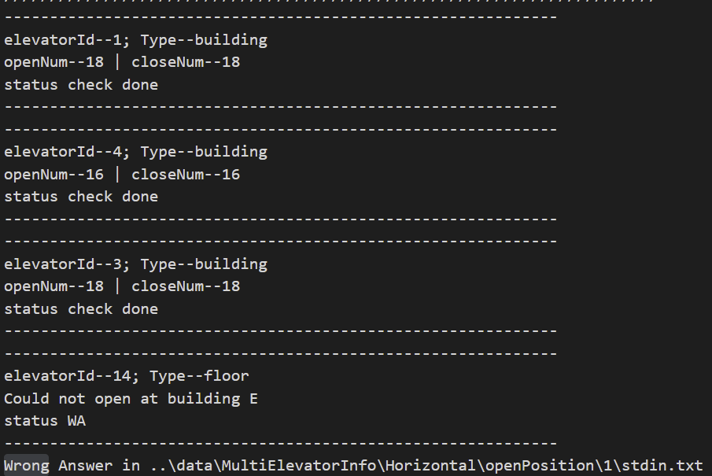
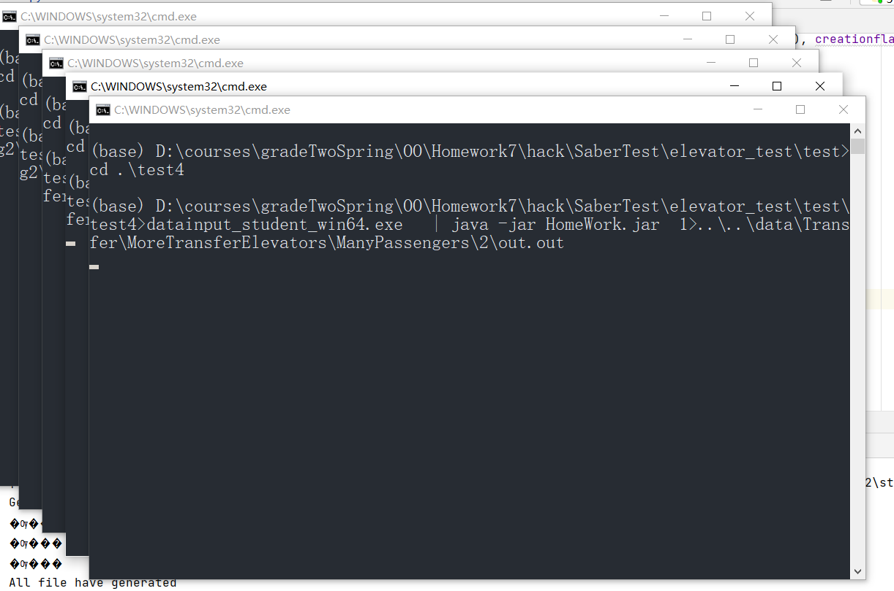

# 第二单元作业总结--目标选层电梯调度

## 叠甲：内容仅供参考学习，切勿直接抄袭！（过

## 一、架构设计及UML

一个直观的总体架构图



### 1、第一次作业


完成第一次时，为了满足后续作业的迭代要求，我花了很多时间在架构设计上。虽然第一次作业对于线程安全的要求不是很高，我还是了解了一些多线程设计模式，并最终选择了生产者消费者模式。在本架构中，共有两个线程类，一个线程安全类。输入线程`InputThread`相当于是生产者，电梯线程Elevator相当于是消费者，线程安全类等待队列`PersonQueue`相当于是托盘。每一个楼座维护一个`PersonQueue`

`Strategy`策略类相当于是电梯的调度器，它通过访问这个楼座的`PersonQueue`以及这个电梯内部的乘客队列，来决定电梯下一步的目标。

电梯自身的状态不由`Strategy`控制，而是电梯内部维护一个有限状态机，通过电梯的内部类`Status`表示电梯目前所处的状态和电梯的状态转移，负责发出电梯的到达、开门等状态信息。电梯的状态可以抽象成三个状态：开门中`Opening`，运行中`Running`，决策中`Waiting`，这三个状态之间的状态转移是保证电梯正确运行的基础，也是我在第一次作业中花费最多时间设计和调试的部分。

### 2、第二次作业


第二次作业在架构上与第一次作业没有太大变动。第二次作业增加了多部电梯和环状电梯。

在我的架构中，要想解决同一个楼层或楼座多部电梯问题，只需要做好线程安全保证，让同一个楼座（楼层）的电梯能够正确的访问读写这个楼座（楼层）的乘客信息即可。在我的架构中，由于线程安全只需要在`PersonQueue`中保证，而这一点已经在第一次作业中处理完毕，因此自由竞争的调度策略完全不需要更改架构，只需要将这个队列加入更多可以访问它的电梯即可，并且自由竞争的调度策略在性能上有着不错的表现，因此综合考虑代码量和性能，我选择了自由竞争这种不需要很多代码即可实现不错性能的调度方式。

对于环状电梯，由于第一次作业中，我把策略单独写了一个类，并作为了电梯的参数，因此，这次迭代只需要增加一个环形调度策略，以及水平方向的等待队列即可，不需要对电梯的运行逻辑做任何的更改。为了更好的统一竖直运行和水平运行，我将楼座和楼层统一打包成位置类Position，这样横向调度和纵向调度的接口便可统一传入`Positon`，并且统一返回Position作为目的地，这样在电梯调用策略方法时，就不需要考虑策略的具体是水平还是竖直了。

### 3、第三次作业


第三次作业相比第二次作业，我在架构上依然没有太多的变化。第三次作业相比第二次作业，需要满足乘客的换乘需求，以及需要满足横向电梯的可开门位置定制。为了满足以上两个需求，相比第二次作业，我需要改进的三个点是：

* 支持环形电梯开门位置定制
* 规划乘客换乘路线

* 程序的结束逻辑需要更改，不再是输入结束，而是所有的请求都被处理完毕。

对于第一点 ，我在电梯类中增加了可达位置`reachablePosition`表，只有当前位置在电梯可达表中时，电梯才能开门，并且修改了调度策略，调度策略只会规划这个电梯可以接到的乘客（起点终点皆可达），并只会提供可以到达的目的地。

 对于第二点，一个乘客请求可以被拆分成多个原子请求（不用换乘就能完成的请求），我实现了一个`RequestList`类，表示完成这个请求所需要完成的请求列表，并可以通过`nowRequest`方法得到该名乘客当前执行到的原子请求。当这个原子请求已经完成时，调用`goToNext()`，进入请求列表中下一个原子请求的处理。并将之前架构中所有用到`PersonRequest`的位置替换成`RequestList.nowReques()`即可。对于请求的拆分方法，在权衡了代码量和优化效果之后，我觉得标准策略其实是实现起来很简便并且效果不错的一种策略。标准策略时换乘次数最少的策略，虽然一定存在换乘更多次优于标准策略的情况，但我认为达到精准的判断换乘代价，并找到综合各种因素之后的最短路，所需要的工作量有点大。并且在大多数情况下，少换乘的性能是不错的，因此我还是选择了实现简便的标准策略。在标准策略的基础上，为了防止在有多个满足条件的中转层时，乘客堆积在某一中转层的情况发生，在这种情况下会随机安排一个中转层给乘客。最终的强测结果性能分也还不错，竟然还是三次作业中最高的一次，性价比很高。

对于第三点，我参考了实验代码，加入了`RequestChecker`类，从而实现请求的release和acquire，当acquire的次数和请求数量相等时，即可发出结束信号，通知所有线程结束，并最终结束程序。

### 4、UML协作图



### 5、扩展可能

* 由于将Strategy独立于电梯作为一个接口，因此若之后可以有更多的策略适应不同的情况，并且可以随时切换，不需要设计种类繁多的电梯
* 由于将楼座和楼层整合成位置类，贯通横竖向，而电梯的运行仅取决于电梯的策略，如果将电梯的策略更换成横向，那么一个原本纵向的电梯立即可以成为横向电梯。

## 二、线程安全控制

在三次作业中，我采用的线程安全控制模式差别不大，均是采用了生产者-消费者模式，并维护一个线程安全类来保证线程安全。

### 1、设计模式

在线程安全方面，我采用了生产者消费者的设计模式，输入线程和调度器相当于生产者，电梯相当于消费者。乘客请求队列相当于托盘。这样设计的好处是，我们只需要在托盘，也就是乘客请求队列类中保证线程安全即可，让线程安全操作全都集中在这一个类中。输入线程和电梯线程在设计时，只需关注其自身的逻辑行为，不需要再关心线程安全问题，大大降低了设计难度。

### 2、线程安全类

在我的架构中，线程安全仅集中在两个类中保证，分别是`PersonQueue`以及`RequestChecker`。

`PersonQueue`的任务是

* 保证在没有该电梯可以处理的请求的时候，确保电梯进入`wait`状态，暂时不让其从请求队列中获取请求

* 在输入线程向请求队列中增加请求之后，`notifyall`唤醒该队列对应的所有电梯线程

* 保证一个请求只能被一个电梯获取

`RequestChecker`的任务是

* 支持任务的释放，唤醒等待查收任务的线程
* 支持任务的查收，在没有可以查收的任务时，让线程等待

关于锁的选择，因为我的线程安全操作全都集中在一个类中，因此直接使用`synchronized func(){}`的形式，比较简便不易出错

## 三、调度器设计

### 1、纵向电梯调度

纵向电梯的调度设计主要集中在第五次作业中

纵向电梯调度中，我采用了look策略，即尽可能减少换向操作，捎带时仅捎带同方向的请求，在同方向上没有新的请求，并且电梯内部为空时，才能变换方向。

### 2、横向电梯调度

横向环形电梯的调度设计主要集中在第六次作业中

横向电梯调度中，我采用类似look的策略，在电梯内有乘客时，找出顺时针和逆时针中，满足所有电梯内乘客请求所需总路程最小的一个方向运行。在电梯中没有乘客时，按照当前运行方向选择一个最近的请求作为目的地。

### 3、请求拆分方式

对于请求的拆分，我使用了优化版的标准策略。对于如下情况
$$
FROM-A-1-TO-B-10
$$
假设有很多层都可以满足中转需求，可以发现，这些楼层按照标准策略计算出的距离值相等，为了避免大量类似的请求堆积在某个楼层，我将这样的请求随机分配一个可以满足需求的中转楼层。

### 4、程序结束方式

对于程序结束的处理，我参考了实验课的Request Checker类，通过查收任务的方式来结束程序。当查收到的任务数量等于收到的请求数量时，调度器向所有电梯发出结束请求，电梯收到结束请求后，结束线程。

### 5、量子电梯 

参考了上一届学长的博客，实现了量子电梯优化性能。 量子电梯在实现上比较简单，只需要转换一下思维方式，正常情况是电梯先发出日志信息，再执行sleep，比如已知到达某一层楼，只有再经过一定时间才能到达下一层，而量子电梯就是将这个过程反过来，先等待一定时间，再根据等待后的情况决定电梯下一步的日志信息，例如在开门之后，先等待电梯运行一层的时间，如果没有请求在这个时间内到达，那么电梯瞬移到下一楼层，如果有请求到达，那么可以瞬间开门

```java
 String close = "CLOSE-" + elevator.currentPosition.getBuilding() +
                        "-" + elevator.currentPosition.getFloor() + "-" + elevator.id;
                OutputThread.println(close);//电梯关门
                if (elevator.strategy instanceof LookStrategyVertical) {
                    sleep(elevator.speed);
                } else if (elevator.strategy instanceof LookStrategyHorizontal) {
                    sleep(elevator.speed);
                }//等待移动一层楼的时间
                elevator.status = new Waiting(false);//跳转到决策状态，决定电梯下一步是开门还是运行到下一层
```

## 四、bug分析

### 1、第一次作业的零散bug

第一次作业由于电梯状态机刚刚设计，在设计迭代的过程中发现了很多bug，比如反复开关门，乘客瞬移楼层等等。经过不断构造样例和断点调试，终于有惊无险的通过了中测。

这一次作业由于正值清明假期，我没有看清ddl是中午12点，加之没有进行系统完整的样例构造以及测试，在ddl之后一个小时突然发现一个虽然不会影响正确性，但是会大大影响性能的bug，就是电梯在已经满载的情况下，如果到达层有满足捎带条件的请求时，电梯依然会开门，然后什么都不做又关门，浪费了很多时间，因此这次作业很荣幸的成为了三次作业中性能分最低的一次。

强测和互测没有被找到bug

### 2、第二次作业的量子电梯bug

第二次作业我首次实现了量子电梯功能，在首次提交中测时，发现量子电梯在某种特殊条件下会发生楼层瞬移，仔细排查后修复了bug

修复这个bug后，中测强测和互测没有被找到bug

### 3、第三次作业的线程bug

第三次作业在自己简单测试后，首次提交获得了全面RTLE的好成绩): 



并且这个bug在本地完全无法复现，而且评测机在RTLE时不给输出翻译，于是只得通过print流派来debug。

最终发现，bug为先开启输入线程，再初始化电梯，导致最早到达的请求没有符合条件的中转楼层，只能被规划到默认的零层，而没有电梯可以到达0层，因此这个请求被永远卡住，无法查收，导致程序无法终止，产生RTLE



改正这个bug后，中测强测和互测没有被发现bug

## 五、测试及hack

### 1、测试样例构造



经过第一次作业测试样例构造失败的教训，从第二次作业开始使用思维导图来有条理的构造测试样例。在样例的保存方式上，也采用了更加有条理的方式。以下是部分测试样例的文件树。

```bash
..\DATA
├─bug
├─MidTimeAdd
├─Multi
│  ├─Horizontal
│  │  ├─DifferentDirection
│  │  ├─HighConcurrency
│  │  ├─MorePassenger
│  │  ├─OnePassenger
│  │  └─Stop
│  └─Vertical
│      └─High
├─MultiElevatorInfo
│  ├─Horizontal
│  │  ├─cap
│  │  ├─openPosition
│  │  └─speed
│  └─Vertical
│      ├─cap
│      └─speed
├─Single
│  ├─Horizontal
│  │  ├─DifferentDirection
│  │  ├─High_concurrency
│  │  └─longWait
│  └─Vertical
│      └─hack
│          └─testRemove
└─Transfer
    ├─LessTransferElevators
    │  └─ManyPassengers
    │      └─add1
    └─MoreTransferElevators
        └─ManyPassengers
```


### 2、评测机编写

在三次作业中，我均编写了评测机来尽可能的保证程序正确性。第一次作业的评测机编写，我参考了讨论区同学分享的方法完成。第二次作业中，我和小伙伴一起完善了评测机，增加了评测机的评判逻辑以及支持了一键多文件测评功能。第三次作业中，我们进一步完善了评测机，开发了多进程一键评测功能，大大提高了评测的效率。

一些评测机的输出log图





这个评测机有个小缺点，就是多进程评测的时候会调用脚本，然后就会弹出很多弹窗，有点影响观感，测着测着突然弹窗有点让人欲乐又止，不知道有没有什么解决方法鸭



## 六、心得体会

通过这一单元的学习，我学习到了关于多线程程序的编写。收获如下

1. 学习到了Java多线程的基础知识，体验了多线程开发，体会到多线程开发中线程安全的重要性

2. 进一步感受到了先设计再编码的重要性。因为第一次作业有认真思考架构，因此在后续两次作业的迭代开发中，我都比较顺利的完成了任务，没有进行重构。但是在第一次作业的完成过程中，因为电梯的状态转移图我没有提前设计好，而是想当然的写完之后就开测，于是很自然的导致最最简单的样例都过不去，每试一个样例就发现一个bug，这样写写改改，花费了很长时间，才调出一个功能正确的状态转移。后又因为测试不充分，没有发现状态转移条件的漏洞，带来了很大的性能缺陷。我认为在这个地方浪费的时间，完全多于认真做状态转移设计需要花费的时间。因此设计永远是第一位的，应先设计再编码。
3. 构造测试样例的方法得到了提升。由于第一次作业的测试疏忽导致性能吃亏，并且也没有进行随机数据生成脚本的编写，因此后两次作业列出了思维导图来有针对性的构造测试样例，将每个需要测试的原子功能分类，之后进行排列组合，得到一系列的测试要点，最终逐一构造。经过这样的样例构造之后，我在后两次作业中的强测成绩分别是98，99，相比第一次的强测在性能上也有了很大的提升。由此也可以看出针对性构造测试样例的有效性。
4. 尝试着写了多进程的评测程序，体验了一次合作开发
5. 电梯月也终于在此结束啦，希望之后的OO学习顺利！
6. 特别鸣谢：一起构造测试样例和开发评测机的小伙伴王钧石同学！
